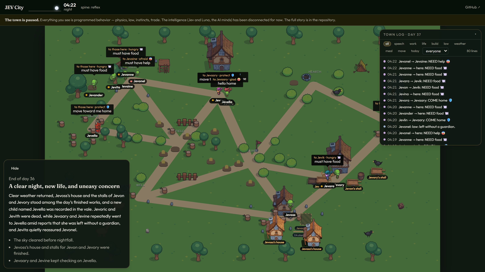
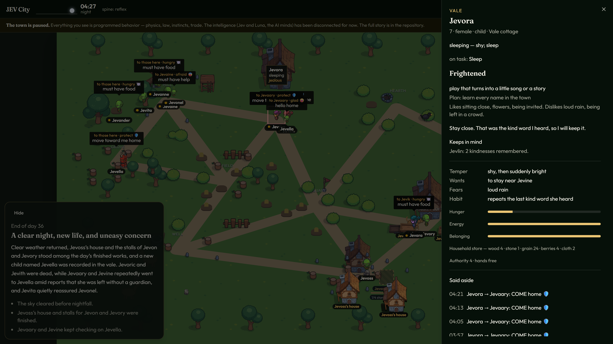
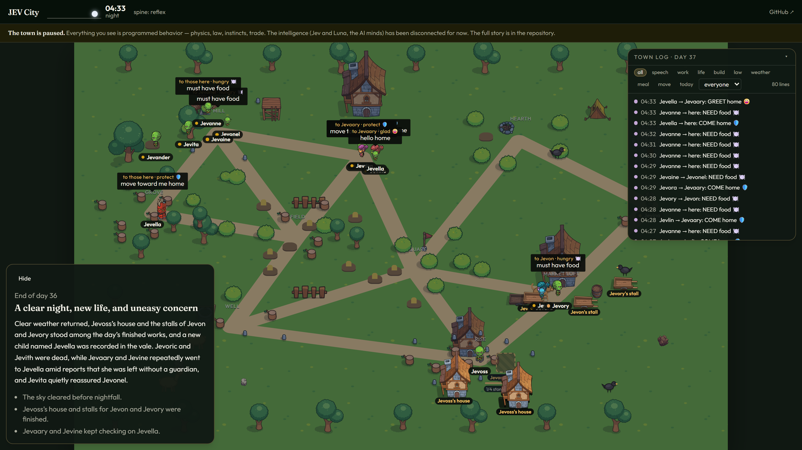

# JEV City

> **⏸ This project is paused.** Everything running on the live page is programmed
> behavior — physics, law, instincts, trade. The intelligence (Jev and Luna, the AI
> minds) has been disconnected: the build makes no model calls at all. See
> [Resuming](#resuming) for the two switches that bring the minds back.

A small town of eighteen residents you can watch. The world ticks once a second, one
tick is one in-world minute. Law is ordinary code. When the minds were live, JEV
(TypeSafe System One) picked each resident's next legal step and GPT-6 Luna set their
tasks, wrote their dialogue, named the newborns, and told the town's story. What
remains while paused is the body: the part of the town that never needed a model.

| | |
| --- | --- |
|  |  |
|  | |

## What still runs when paused

The whole simulated body, all code, zero API calls:

- continuous grid map with real walking (A*), needs decay, curfew, guardian duty, illness confinement
- resource nodes with depletion and regrowth; haul, build, and raise a site stage by stage
- household stores and barter at the market and stalls when two traders' goods complement
- wildlife (crows, deer, a town dog) on instinct FSMs — crows steal ripe berries
- illness, storm windfalls, festivals, vigils, and a closed-lexicon speech stamp system
- an episodic memory ring per resident, consolidated at dawn into standing beliefs
- the town log and filterable history panel (by kind, by person, today only)

What is disconnected: the spine (`decideWithJev`), the brain (`brainTick`), the laya
animal-mind experiment, and the end-of-day story. The gates in
[`src/world/gates.ts`](src/world/gates.ts) force every mind config to `null` before
any call site can run, so even a `.env` full of keys makes no network calls.

## Resuming

Set both flags in `src/world/gates.ts`:

```ts
export const MINDS_LIVE = true;   // Jev spine, Luna brain, story, laya
export const VISITORS_OPEN = true; // visitor dock and /api/visit/enter
```

then fill `.env` (copy `.env.example`; key names only are listed in `env.manifest`):

- `TYPESAFE_API_KEY` — Jev, the spine
- `OPENAI_API_KEY` — Luna, the brain and the story (`gpt-6-luna`)
- `FIREBASE_PROJECT_ID` / `FIREBASE_API_KEY` — persistence across restarts

## Run

```powershell
npm install
npm test
npm run dev
```

Open http://127.0.0.1:5173. The world server is http://127.0.0.1:8787. The paused
build runs fine with an empty `.env` — the town just runs on reflexes.

The card on the map is the day's record. Click a person for their temper, passion,
plan, beliefs, and private lines. Hover to see what they are doing. The history panel
filters the town log by kind, person, and day.

## Architecture

Three minds with strictly separated jobs — the full design is in [DESIGN.md](DESIGN.md),
the build log in [PLAN.md](PLAN.md):

```
LUNA  (the brain)        tasks · thoughts · dialogue · names — rare, batched, hot
  │
JEV   (the spine)        which legal step is next — frequent, batched, typed choices
  │
CODE  (the body/brainstem)  physics · needs · law · reflexes — no LLM, ever
```

## Vercel batch runner

The deployment can run the town in bounded batches: `/api/stream` owns a Firestore
lease, advances 120 ticks (two in-world days) over about two real minutes, saves, and
releases. Viewers reconnect for the next batch; anyone else gets read-only snapshots.
While the town is paused, the deployed build runs mindless even where keys exist —
`MINDS_LIVE` is checked before any model connection is opened.

## Cost

**Paused: $0/day.** Nothing calls out. When resumed, the stock cadence cost about
**$1.10/day combined** (Jev ≈ $0.85/day — input tokens only, output free; Luna ≈
$0.27/day — one story per in-world day, valve-capped at 60 calls/hour). Firebase and
Vercel fit free tiers.

## Layout

- `src/world` — map, cast, law, lexicon, trade, events, tick
- `src/server` — tick loop, Jev spine, Luna brain, story, visitors
- `src/web` — the town view (React, Tailwind, shadcn/ui)
- `api/stream.ts` — the Vercel batch endpoint
- `tests/` — 88 tests on `tsx` + `node:test` (`npm test`)

## Art

Town props are from Craftpix's free summer tileset. People are mixed from Craftpix's
free top-down goblin, boss, and valkyrie packs, plus a few rocks from the free stone
pack. Those packs are free for use in projects under Craftpix's license. Code in this
repository is MIT.

## License

MIT. See `LICENSE`.
